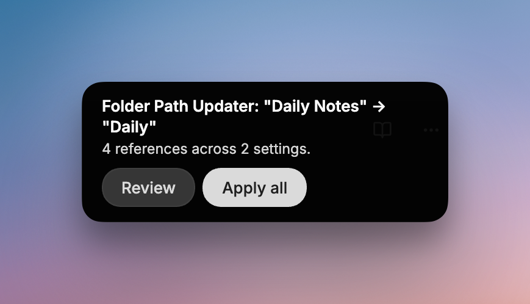
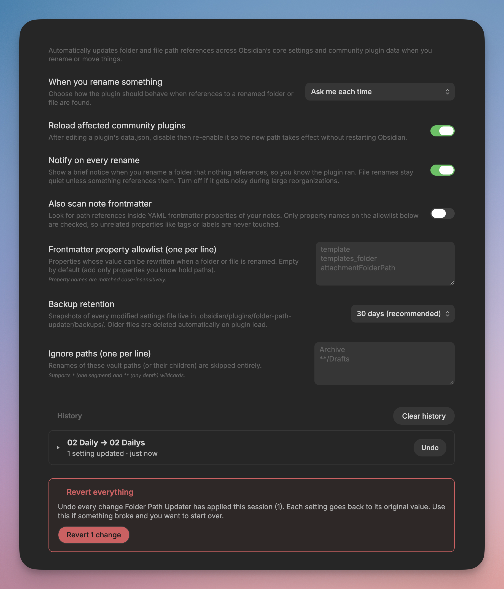

# Folder Path Updater

Automatically updates folder and file path references in Obsidian's settings and community plugins when you rename or move things.

  

When you rename or move your daily notes folder, Obsidian updates `[[wikilinks]]` in your notes automatically, but the **Daily Notes** core plugin still points at the old folder and the same goes for the settings of every core and community plugin you have installed. Folder Path Updater updates those settings automatically.

## What it does

- Watches for rename and move events on any folder or file in your vault.
- Scans Obsidian's core feature settings and every community plugin's `data.json` for references to the old path.
- Rewrites those references to point at the new path: either silently, with a notification, or only with your approval.
- Catches **chained renames**: if you skip an `A → B` proposal then rename `B → C`, the plugin notices that settings still say `A` and rewrites them to `C`.
- Detects **deletions**: when you delete a folder/file that something still references, you get a notice with a **Redirect** button — pick a new target path and the orphan references are rewritten in one go.
- Optionally scans note **frontmatter properties** for path values (opt-in, with a per-property allowlist).
- Keeps a persistent **history** of every rename across sessions: the current session is front and centre with one-click Undo per group; previous sessions sit below in a read-only collapsible view.
- **Undo is full reversal** — clicking Undo rolls the settings back *and* renames the folder/file back to its original name in one click. Same for Re-apply.

## Modes

Set in the plugin's settings page:

- **Ask me each time:** A notification appears with the option to apply all changes at once or review them individually, or dismiss everything. *Default.*
- **Automatically apply (with notification):** applies every match and shows a summary notice.
- **Notify (no action taken):** finds matches, logs them to history, shows a notification with a *View* button to view the log. Nothing is changed; you can still apply later from history if you want.

  

The settings tab houses: the mode dropdown, an auto-reload toggle, a "Notify on every rename" toggle, an opt-in frontmatter scan with its own allowlist, a backup-retention dropdown, and a glob-aware ignore list (`*` for one segment, `**` for any depth). Below the settings is the **History** of every rename — current session up top with per-group Undo / Re-apply, previous sessions below as read-only collapsible cards, and a red **Revert everything** danger button for rolling the whole session back in one shot.

> **Reload affected community plugins** (on by default) makes the plugin disable then re-enable any community plugin whose `data.json` was just edited, so the new path takes effect without restarting Obsidian. Turn it off if you'd rather restart Obsidian yourself.

## Safety

The matcher is careful by design — it only changes a value when it's clearly a real path:

- **Folder prefix matches:** (e.g. `Daily Notes/2026/foo.md` → `Daily/2026/foo.md`) always safe.
- **Exact value matches:** only when the field name looks like a path field (`folder`, `path`, `template`, `dir`, etc.) **or** the value has a slash.
- Simple word matches in unknown fields are skipped to prevent mistakes like a plugin saving `"Notes"` as a tag name.

Before every change, a backup is saved in `.obsidian/plugins/folder-path-updater/backups/`. You can see every change in the session history with a full diff and can undo each one. There's also a red danger-zone button to undo all changes from this session.

## What it does **not** cover

- Markdown body content (Obsidian's built-in updater handles `[[wikilinks]]` and `[markdown links](path)`; hardcoded paths inside code blocks or plain text are not touched).
- `.canvas`, `.base`, or `.excalidraw` file internals.
- CSS snippets and themes.
- Plugin state stored in files other than `data.json`.
- Renames performed while Obsidian was closed (Finder, Explorer, `git`). Use the **Rewrite a path manually** command for these.
- Plugin in-memory caches that don't refresh on disable/enable.

*(Frontmatter property values can be scanned when you turn on the dedicated toggle and add property names to the allowlist.)*

## Installation

### From the Community Plugins directory

Install from **Settings → Community plugins → Browse** and search for *Folder Path Updater*, or view the listing at [community.obsidian.md/plugins/folder-path-updater](https://community.obsidian.md/plugins/folder-path-updater).

### Manually

1. Download `main.js`, `manifest.json`, and `styles.css` from the latest [GitHub release](https://github.com/TheGentleTurtle/obsidian-folder-path-updater/releases).
2. Copy them into `<vault>/.obsidian/plugins/folder-path-updater/`.
3. Reload Obsidian and enable the plugin under **Settings → Community plugins**.

### Via BRAT

Add `TheGentleTurtle/obsidian-folder-path-updater` in [BRAT](https://github.com/TfTHacker/obsidian42-brat).

## License

MIT — see [LICENSE](LICENSE).
